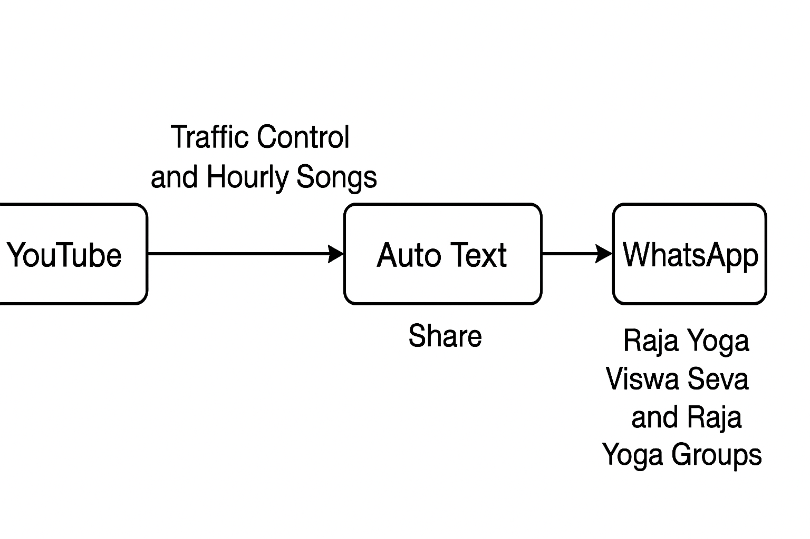

# Automation Steps – Raja Yoga Traffic Control & 1-Minute Songs

## Overview
This document explains how the automation system automatically shares Traffic Control songs (3-minute meditation reminders) and 1-minute hourly meditation songs for Raja Yoga practitioners using a YouTube playlist and WhatsApp channels/groups.

---

## Traffic Control Song Schedule
Traffic control songs remind Raja Yogis to pause their activities and remember Paramathma at specific times.

### Daily Timings
- **3:30 AM**
- **5:45 AM**
- **7:00 AM**
- **10:30 AM**
- **12:00 Noon**
- **5:30 PM**
- **7:30 PM**
- **9:30 PM**

---

## Hourly 1-Minute Songs
1-minute meditation songs are played every hour from:

- **4:00 AM to 10:00 PM**  
(17 times per day)

---

## Automation Process
1. **YouTube Playlist Management**  
   - Songs are uploaded and managed in a dedicated YouTube playlist.

2. **Auto Text Mobile App**  
   - Automatically sends YouTube links at the scheduled times.

3. **WhatsApp Channel & Groups**  
   - Distributes songs to:
     - Raja Yoga Viswa Seva WhatsApp Channel
     - Four other Raja Yoga WhatsApp groups

4. **Operation Window**  
   - The system runs between 3:30 AM and 10:00 PM (not 24/7).

---

## Visual Workflow Diagram
A simple visual representation of the automation flow is available here:

---

## Benefits
- Provides timely meditation reminders.
- Eliminates the need for manual link sharing.
- Enhances consistency in spiritual practice.

---

## Related Repository Files
- [README.md](./README.md) – Project overview
- [automation_steps.md](./automation_steps.md) – This detailed automation guide
